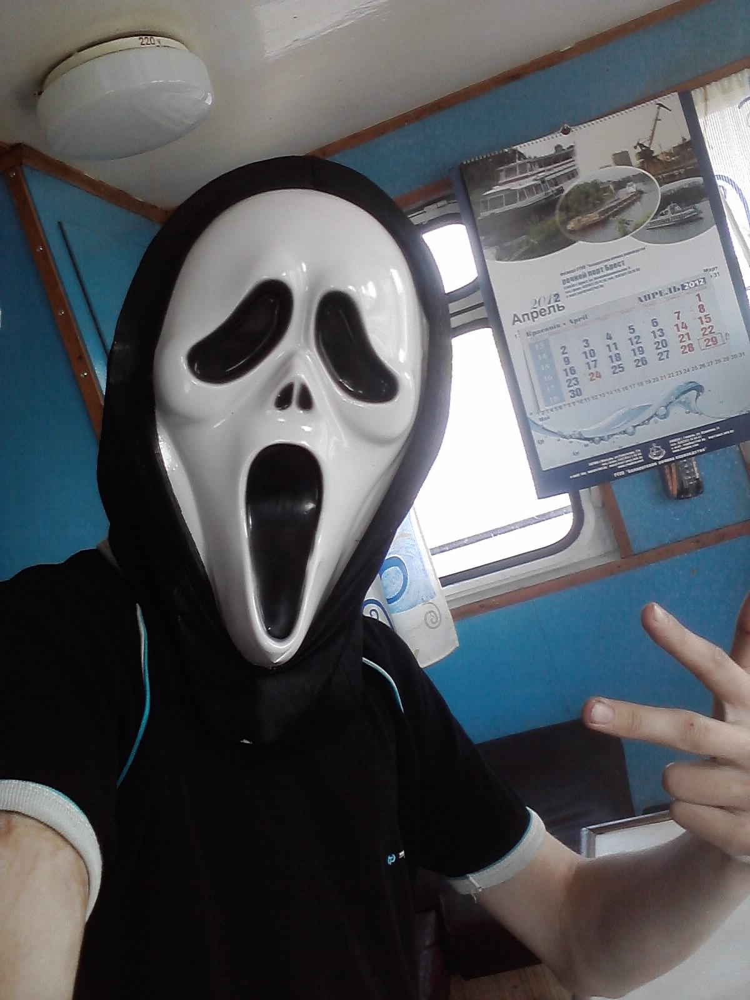

# Инструкция для работы с Маркдавн

## Выделение текста

Что бы выделить текст курсивом, необходимо обрамить его звездачками (*) или знаком нижнего подчеркивания (_). 

Пример. *вот так* или _вот так_

Что бы выделить текст полужирным, необходимо обрамить его двойными звездочками (**) или двойным знаком нижнего подчеркивания (__).

Пример. **вот так** или __вот так__

Альтернативный способ выделения текста жирный или курсивом, нужны для того, что бы мы могла их совмещать

Пример: _курсив и **полужирный**_

## Списки

## Работа с изображениями

Что бы вставить изображение в текст достаточно написать следующее:

## Ссылки

## Работа с таблицами

## Цитаты

## Заключение